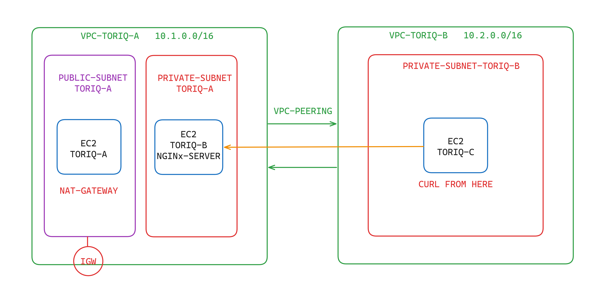

# Cross VPC Connection

This project demonstrates how to establish a connection between two Amazon EC2 instances residing in separate VPCs, with the addition of a NAT Gateway for internet access. The setup involves configuring an Nginx server on one instance in a private subnet, enabling communication from another EC2 instance in a different VPC's private subnet, and providing internet access through a NAT Gateway.

## Setup

1. **Create Two VPCs:**

   - Launch two VPCs, each with its own CIDR block:
     - VPC-A: 10.1.0.0/16
     - VPC-B: 10.2.0.0/16

2. **Create Subnets:**

   - In each VPC, create subnets:
     - VPC-A:
       - Public Subnet: `PUBLIC-SUBNET-TORIQ-A`
       - Private Subnet: `PRIVATE-SUBNET-TORIQ-A`
     - VPC-B:
       - Private Subnet: `PRIVATE-SUBNET-TORIQ-B`

3. **Launch EC2 Instances:**

   - Launch three EC2 instances:
     - Instance A: In the public subnet of VPC-A, launch an instance that will act as a bastion server.
     - Instance B: In the private subnet of VPC-A, launch an instance that will host an Nginx server.
     - Instance C: In the private subnet of VPC-B, launch an instance from which we will try to access the Nginx server.

4. **Configure Security Groups:**

   - Create security groups and configure rules to allow the necessary traffic:
     - **Bastion Server Security Group:**
       - Allow SSH access from your local machine.
     - **Nginx Server Security Group:**
       - Allow inbound traffic on port 80 (HTTP) from the private subnet of VPC-B.
     - **Private Server Security Group:**
       - Allow outbound traffic on port 80 (HTTP) to the private subnet of VPC-A.

5. **Enable VPC Peering:**

   - Establish VPC peering between VPC-A and VPC-B. This allows communication between instances in the two VPCs.

6. **Create NAT Gateway:**

   - Create a NAT Gateway in the public subnet of VPC-A to provide internet access for instances in the private subnet.

7. **Install and Configure Nginx:**

   - On Instance B (the Nginx server), install and configure Nginx. Ensure the Nginx server is listening on port 80 and can serve a simple web page.

8. **Test Connectivity:**
   - From Instance C (the private server in VPC-B), use `curl` to access the Nginx server on Instance B. You should be able to successfully retrieve the web page served by the Nginx server.

## Diagram

The diagram depicts the network topology with the addition of the NAT Gateway:

<figure > 

  

</figure>

## Notes

- This setup demonstrates a basic cross-VPC connection. You may need to modify security groups, firewall rules, and other configurations depending on your specific requirements.
- Ensure that you adhere to best practices for security and network management when working with VPC peering and cross-VPC communication. Consider implementing encryption and access controls for enhanced security.
- This setup includes a NAT Gateway for internet access from the private subnet.
- Ensure that the route tables are properly configured to route internet-bound traffic through the NAT Gateway.
- Regularly monitor and optimize the performance of the NAT Gateway to ensure efficient internet access for instances in the private subnet.
